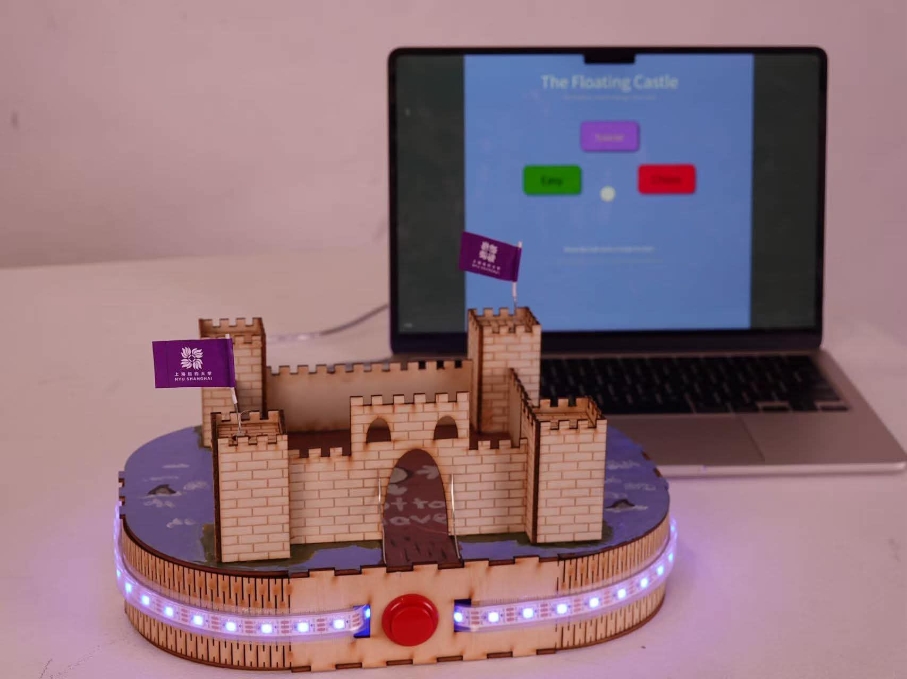

# Floating/Tilting Castle Game

An interactive Arduino-based game that uses an **MPU6050 accelerometer/gyroscope** to detect the tilt and movement of a physical castle controller. The project combines Arduino hardware with **LEDs, servo motors, buttons, and Processing** to create an interactive game with visual and mechanical feedback.

## Features

* MPU6050 motion sensor for tilt-based controls
* LED feedback for game states and player interaction
* Servo motors for physical movement
* Arduino-to-Processing serial communication at 115200 baud
* Multiple game modes: **Tutorial, Endless, and Chaos**
* Button-controlled mode selection and gameplay
* Game-over and feedback states

## Hardware

* Arduino
* MPU6050 accelerometer/gyroscope
* LEDs
* 2 servo motors
* Push button

## Software

* Arduino/C++
* Processing
* Serial communication

## Project Overview

The project combines physical hardware with programmed game mechanics and real-time sensor input to create an interactive gaming experience. The MPU6050 detects the controller's movement and tilt, which is communicated between the Arduino and Processing to control gameplay and provide visual and mechanical feedback.
**Portfolio:** [View my portfolio](https://sites.google.com/nyu.edu/ryan-lin-ima-projects/home?authuser=5)
